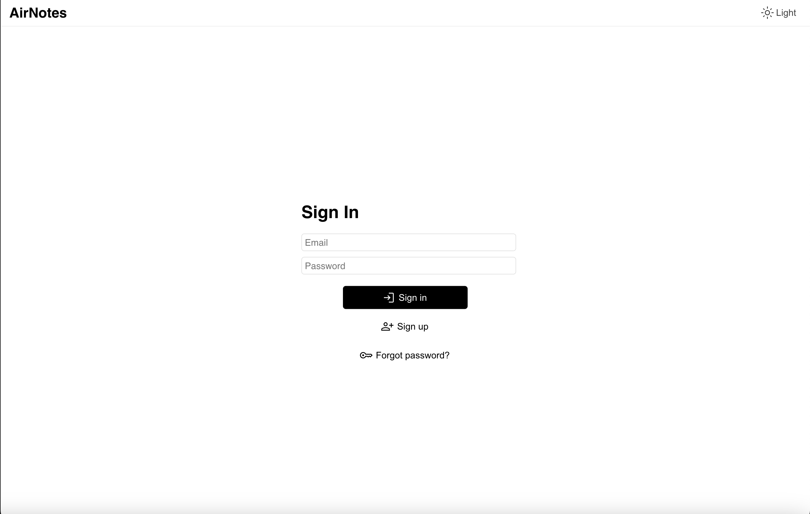
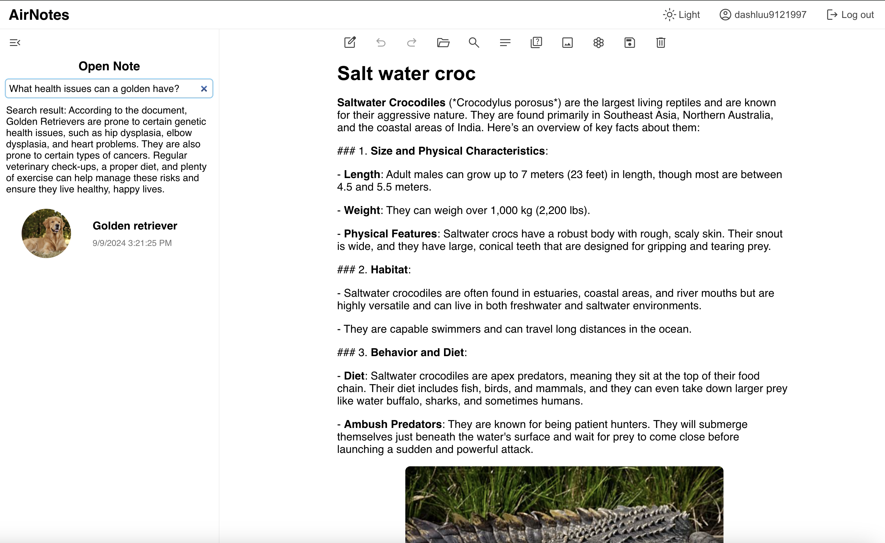

# AirNotes AI Backend






## Requirement
* LlamaIndex and Ollama for LLM
* MLX for Stable Diffusion
* FastAPI for web server

## Usage
Clone the repository

```angular2html
git clone https://github.com/dashluu/AirNotes-backend-AI.git
```

Go to the project directory and run

```angular2html
uvicorn server:app --reload
```

The server can now accept request from the frontend!