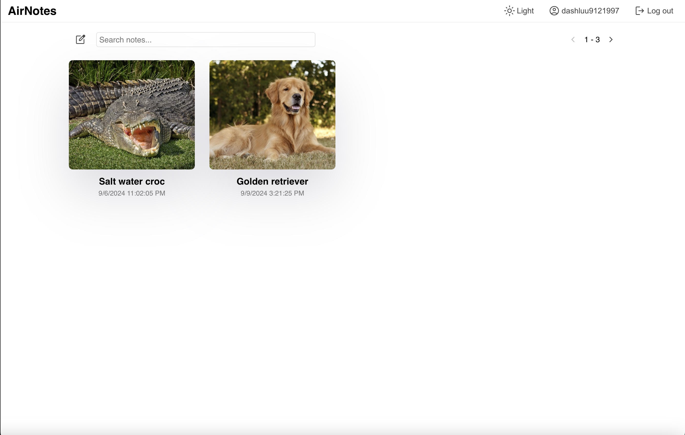

# AirNotes AI Backend

The backend of a basic note taking app inspired by Notion. There are still bugs regarding the UI and features so this web app should not be used in production. Sample screenshots are included below.





## Requirement
* LlamaIndex and Ollama for LLM
* MLX for Stable Diffusion
* FastAPI for web server
* ChromaDB for vector database
* Firebase reader for syncing with remote Firebase server

## Usage
Clone the repository

```
git clone https://github.com/dashluu/AirNotes-backend-AI.git
```

Go to the project directory and run

```
uvicorn server:app --reload
```

The server can now accept request from the frontend. Check out my frontend app here https://github.com/dashluu/AirNotes-web

## Features
- [x] Generate summary using context from the current document
- [x] Generate answer to question using context from the current document
- [x] Semantic search across all documents
- [x] Generate images with Stable Diffusion(slow)
